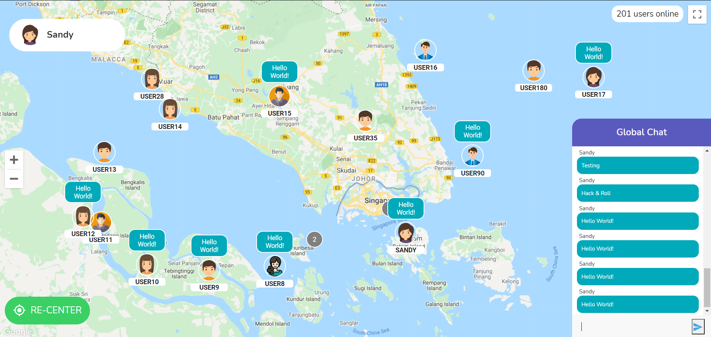
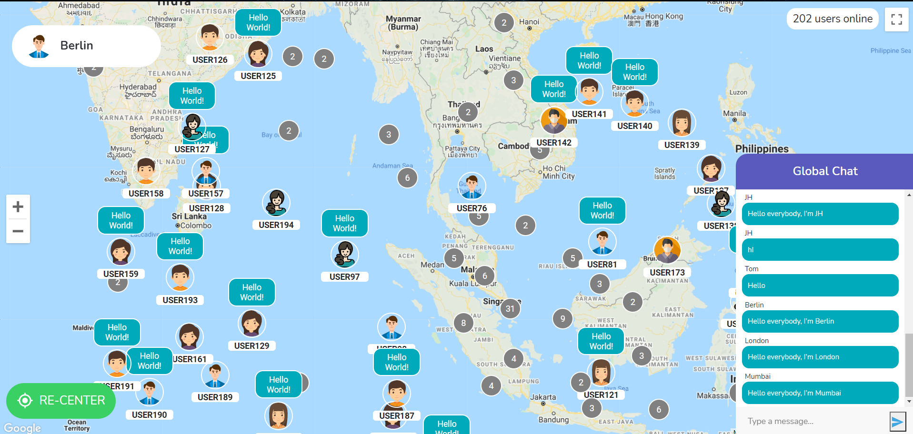

# Welcome to the HelloWorld App


Feeling bored? Chat with people around the world!

HelloWorld is an application designed for connecting users throughout the globe with an interactive map display.

## Screenshots
*Joining in the fun!*

*Chat with people around you!*

*See people around the world!*

*Disclaimer: The app is partially populated with fake data.*

## Rationale
During COVID-19, it's hard to meet other people. Due to the frustration and ongoing boredom people may face, we have decided to create a web application for people from all around the world to chat and make new friends!

## Quick Start
### Setting up
1. Get a Google Maps API key by following the guide [here](https://developers.google.com/maps/documentation/javascript/get-api-key).  
    Remember to enable Maps JavaScript API in your Google Cloud Platform.
    
2. Clone the repo
   ``` cmd
   git clone https://github.com/HelloWorldHnR/HelloWorld.git
   ```

3. Install NPM packages for server
    ``` cmd
    npm install
    ```

4. Install NPM packages for client
    ``` cmd
    cd client
    npm install
    ```

5. Add a `.env` file in the client directory with your API
    ```
    REACT_APP_GMAPS_API = ENTER YOUR API
    ```

6. Add another `.env` file in your root directory with your MongoDB Atlas connection string
   ```
   mongoURI = mongodb://(MongoDB connection string)
   mongoAtlasURI = mongodb+srv://(MongoDB Atlas connection string)
   ```
   Also ensure that you have MongoDB installed locally


### Usage
Run `npm run dev` in the command line to run the client and server locally.

## Contributors:

- [**Francis Hodianto**](https://github.com/FH-30)
- [**Dhafin Razaq Oktoyuzan**](https://github.com/dhafinrazaq)
- [**Lim Jin Hao**](https://github.com/JinHao-L)
- [**Keane Chan Jun Yu**](https://github.com/keanecjy)
