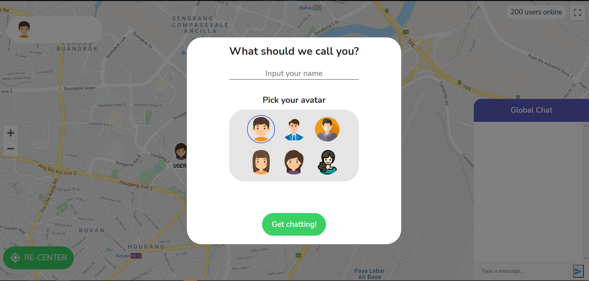

# Welcome to the HelloWorld App

Feeling bored? Chat with people around the world!

HelloWorld is an application designed for connecting users throughout the globe with an interactive map display.

## Screenshots
*Joining in the fun!*

*Chat with people around you!*

*See people around the world!*

*Disclaimer: The app is partially populated with fake data.*

## Rationale
During COVID-19, it's hard to meet other people. Due to the frustration and ongoing boredom people may face, we have decided to create a web application for people from all around the world to chat and make new friends!

## Quick Start

## Contributors:

- [**Francis Hodianto**](https://github.com/FH-30)
- [**Dhafin Razaq Oktoyuzan**](https://github.com/dhafinrazaq)
- [**Lim Jin Hao**](https://github.com/JinHao-L)
- [**Keane Chan Jun Yu**](https://github.com/keanecjy)
